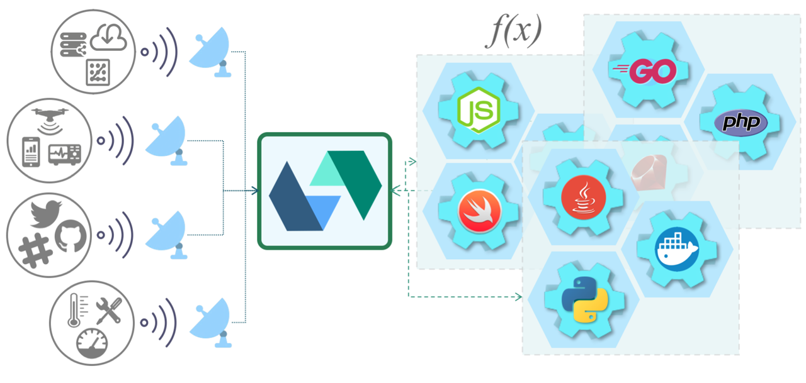
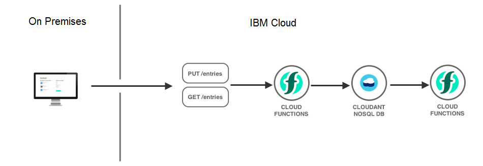
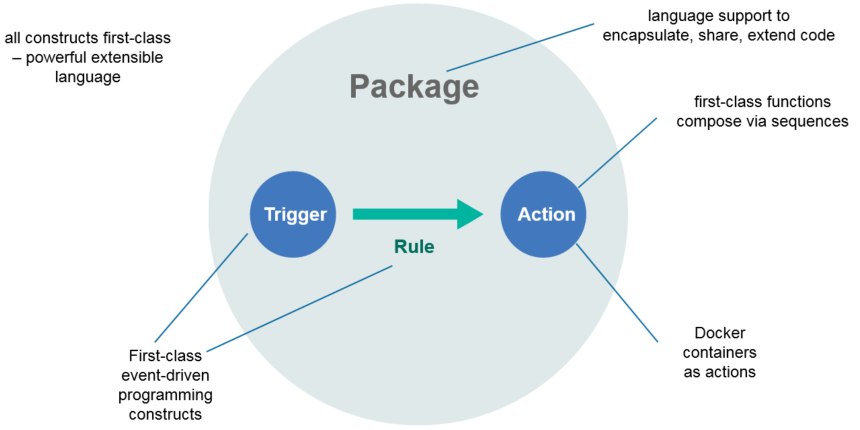
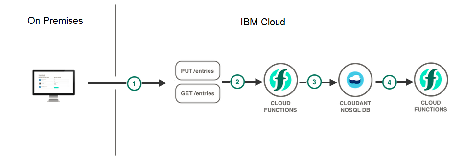
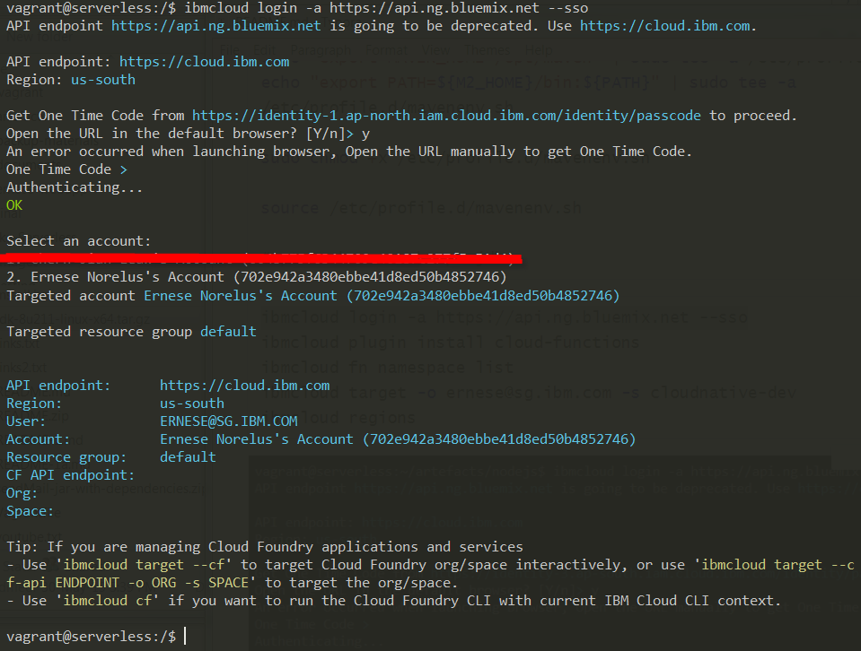
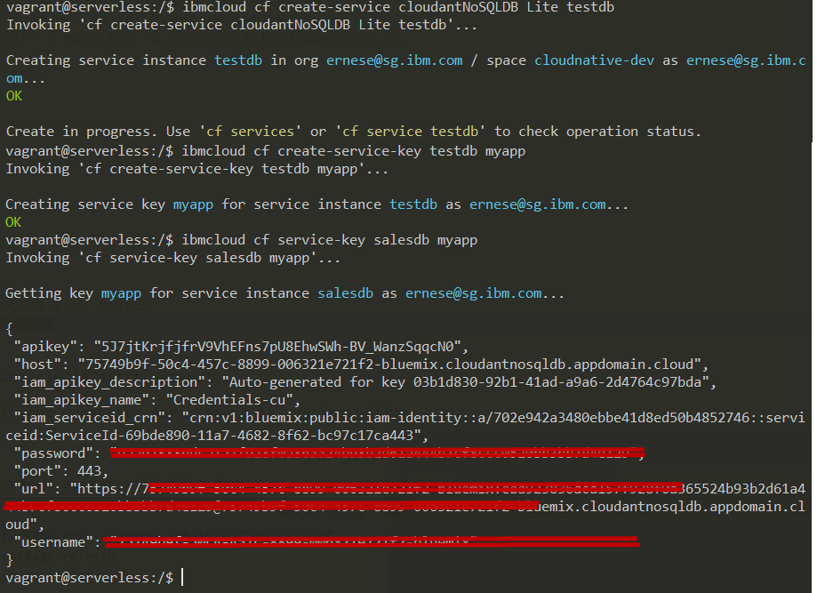
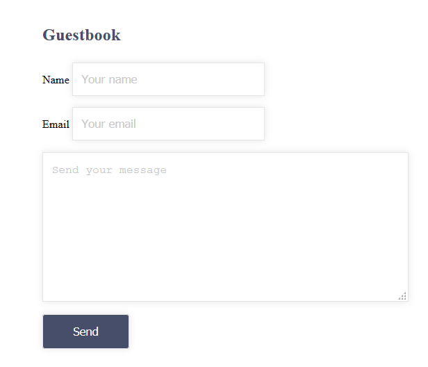
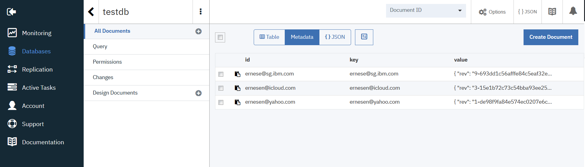
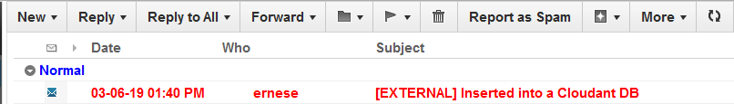

# OpenWhisk: Polyglot Application with IBM Cloud Functions

## Serverless (Functions-as-a-Service) computing is the next step in cloud evolution.


Figure 1: OpenWhisk Abstract Architecture Diagram. Image credit: [Apache OpenWhisk™](https://openwhisk.apache.org/images/illustrations/OW-Abstract%20Architecture%20Diagram.png).

This blog is co-authored with [Enrique (Ike) Relucio](relucio@ph.ibm.com) as part of our IBM Cloud Garage Engagements. Developing a single application is easy, how do you go about showing extensible use of cloud-native features with multiple functions that have been our experience, and we wanted to show a bit more than the traditional HelloWorld.

In recent years, the conversations have been predominantly on microservices; we have since built a great deal of architecture supporting the transformation to Cloud, and along the way, we have gained enough knowledge and, Serverless is the next step in cloud evolution. With regards to Serverless, four concepts are what you need to understand as an architect or developer if you master these four concepts: packages, actions, rules, and triggers (PART), you are nearly 80% done with regards to Apache OpenWhisk concepts; IBM Cloud Functions is IBM's commercial implementation of OpenWhisk, which exposes application logic by implementing Serverless microservices. You might ask, what is a good use case for using Serverless also know as Functions-as-a-Service (FaaS); we are glad you requested; we are going to take you on a Serverless journey, and shed light on a real-world Serverless project!

But before we delve in the weeds; let's give you a quick crash course; as we are going to assume that you are reasonably new to Serverless computing concepts and draw on this to introduce you to our topic so that you don't feel constraint with our demo, Serverless can be explained as follow:
- Respond to events by invoking functions
- Functions are loaded and exited on demand
- Chain together with triggered events from other services
- Serverless, in this case, means that 3rd party cloud providers are managing it, such as IBM Cloud, AWS, Google, Azure, etc. And not to confuse with no server required; we often get asked this question. 

You can run your application code without servers or should we say without having to be bothered by the infrastructure or a server, scale it automatically, and pay nothing when it's not in use (pay for what time you use down to one-tenth of a second). That is in short, what Serverless provides. As a developer, you should only focus on building applications rather than managing infrastructure. Serverless computing 's most significant breakthrough is that it enables developers to get started with a project without having to worry about the details of system management as compared to working with a VM. What is essential to understand is that you don't have the responsibility of managing and patching any infrastructure at all, all your energy should be focusing on understanding the problem at hand versus having to be bothered by the servers, thus; the term serverless.

In this blog post, we'll explore and demonstrate the fundamentals of Apache OpenWhisk on IBM Cloud with IBM Functions and demonstrate setting up and running it as well. We will also show integration with various services, including the Cloudant database and develop the different implementation languages, such as Node.js, Python, and Java as a polyglot application. The events triggered will invoke third-party service integration, such as Cloudant database, and email notification.



Figure 2: A high-level view of the Serverless solution

For more literature on IBM Cloud Functions, please visit https://cloud.ibm.com/openwhisk/; while you are there, go ahead and create an account for yourself if you don't already have an account with [IBM Cloud](https://cloud.ibm.com/). The free tier quota is sufficient for completing this tutorial. You can also use other Serverless framework, but our focus is on IBM Cloud Functions and OpenWhisk; the application will be running on premises. 

This project contains a sample polyglot application to send either emails or text messages to specific users depending on which information have provided in their profiles.

We are going to demo a polyglot Serverless application built with OpenWhisk on IBM Cloud.

## What is Serverless Computing?
Serverless computing is a cloud-computing execution model of a software design pattern where a third-party service hosts applications and best described with the following characteristics:
- Emphasis on code snippets rather than on servers of platforms
- Execute code without the need to provision resources
- Function as a fundamental unit of deployment follows the concept of FaaS (Function as a Service) with a very well defined purpose.
- It's a short live process that could last milliseconds rather than minutes
- The function is the unit of control

## Introduction to Apache OpenWhisk
OpenWhisk was Originally developed at IBM as part of the Bluemix platform, now knows as IBM Cloud. It was donated to the Apache Foundation thus its new name Apache OpenWhisk; under the IBM's commercial offering called IBM Cloud Functions and hosted on IBM Cloud.

_Apache OpenWhisk (Incubating) is an open source, distributed [Serverless](https://en.wikipedia.org/wiki/Serverless_computing) platform that executes functions (fx) in response to events at any scale. OpenWhisk manages the infrastructure, servers and scaling using Docker containers so you can focus on building amazing and efficient applications._             

_The OpenWhisk platform supports a programming model in which developers write functional logic (called [Actions](https://github.com/apache/incubator-openwhisk/blob/master/docs/actions.md#openwhisk-actions)), in any supported programming language, that can be dynamically scheduled and run in response to associated events (via [Triggers](https://github.com/apache/incubator-openwhisk/blob/master/docs/triggers_rules.md#creating-triggers-and-rules)) from external sources ([Feeds](https://github.com/apache/incubator-openwhisk/blob/master/docs/feeds.md#implementing-feeds)) or from HTTP requests. The project includes a REST API-based Command Line Interface (CLI) along with other tooling to support packaging, catalog services and many popular container deployment options._ [*](https://openwhisk.apache.org/)           

### OpenWhisk Architecture
A few paragraphs ago, we allude that you only needed to understand four critical parts of OpenWhisk, which were: actions, packages, triggers, and rules, it's now time to elaborate a bit on each point and walk you through the process of using each one. 

- _**Actions** are stateless code snippets that run on the Apache OpenWhisk platform. You can develop an action (or function) via [Node.js](https://github.com/apache/incubator-openwhisk-runtime-nodejs), [Swift](https://github.com/apache/incubator-openwhisk-runtime-swift), [Java](https://github.com/apache/incubator-openwhisk-runtime-java), [Go](https://github.com/apache/incubator-openwhisk-runtime-go), [Scala](https://github.com/apache/incubator-openwhisk-runtime-java), [Python](https://github.com/apache/incubator-openwhisk-runtime-python), [PHP](https://github.com/apache/incubator-openwhisk-runtime-php), [Ruby](https://github.com/apache/incubator-openwhisk-runtime-ruby) and [Ballerina](https://github.com/apache/incubator-openwhisk-runtime-ballerina). You can create and customize your own executables as Zip Actions which run on the [Docker](https://github.com/apache/incubator-openwhisk-runtime-docker/blob/master/README.md) runtime by using the [Docker SDK](https://github.com/apache/incubator-openwhisk-runtime-docker/blob/master/sdk/docker/README.md). Actions can be explicitly invoked or run in response to an event. In either case, each run of an action results in an activation record that is identified by a unique activation ID. The input to an action and the result of an action are a dictionary of key-value pairs, where the key is a string and the value a valid JSON value._ [1](https://medium.com/@doh_88292/how-to-develop-functions-as-a-service-with-apache-openwhisk-996a9bf8716b)  [2](https://openwhisk.apache.org/)
- **Triggers** are associated with those feeds fire when an event occurs where developers can map actions to triggers using rules.
- **Rules** are used for wiring an action or series of actions for a given trigger name by an event as input; multiple triggers can invoke the same action.
- **Packages** provide event feeds; they are a way of keeping actions grouped; anyone can create a new package for others to use, similar to actional they can have parameters as well.


Figure 3: OpenWhisk Architecture

## End-to-end OpenWhisk Polyglot Application
In recent years, Serverless programming models has become much easier to develop because of its rich set of runtimes, features and supported platform in addition to the current runtime supported languages including native support.

Adopting software engineering best practices for Serverless applications, it is advised to keep functions small and focused on a single task. Small single-purpose functions are easier to develop, test, and debug. 

We will explore how to develop and deploy end-to-end Serverless applications in the cloud using IBM Cloud Functions. To make things interesting, we will use the concept of polyglot, where we will leverage on some core functionalities of  OpenWhisk, such as Node.js for the Cloudant database, Java for the landing page and python for email notification, as depicted below: 

Figure 4: End-to-end OpenWhisk Polyglot Application

Although the component architecture is self-explanatory, it never hurts to be sure the audience understand the concepts by providing a bit more details. 
We will explore all the topics discussed earlier and make this come to life in this demo:

1- **Trigger** comes from web page (a class of events that belongs to an application; anything that is event is known as a trigger)
2- **Action** up on submission request from web page; it's the event-handler that responds to an event; this where you write your code; an action is associated with a trigger)
3- The Cloud Functions actions use IBM Cloudant to store entries from Web page.
4- An email is sent every time a new entry is created in Cloudant database  as **Rule** ( send some event)

As depicted above; the developer only needs to care about implementing the desired application logic - the system handles the rest.

### Prerequisites
To follow along, you are required to have these accounts and tools in place:
- Start with an account on [IBM Cloud](https://cloud.ibm.com/), it's free of cost to start with
- Download [OpenWhisk CLI](https://cloud.ibm.com/openwhisk/learn/cli) button on the OpenWhisk page for all the instructions you need.
- [Vagrant](https://www.vagrantup.com/downloads.html): download the proper package for your operating system and architecture.
- [VirtualBox](https://www.virtualbox.org/wiki/Downloads): by downloading, you agree to the terms and conditions of the respective license.
- [Apache Maven](https://maven.apache.org/download.cgi)
- [Sendgrid](https://sendgrid.com/solutions/email-api/) account
- [Java 8 JDK from Oracle](http://www.oracle.com/technetwork/java/javase/downloads/index.html)

### Setting up the environment
We have created a [git repo](https://github.com/ernesen/serverless) with the steps needed so that you can reproduce the demo if you need a local instance running on a vagrant box with IP 192.168.99.157

You will need to have all of the below installs to run the demo if you want to follow along, as for the IBM Cloud Functions CLI it is included in the script below.

``` sh
#!/bin/sh

#sudo apt-get update && sudo apt-get upgrade -y

# install github
sudo apt-get install git -y

# jq is a sed-like tool that is specifically built to deal with JSON format.
sudo apt-get install jq -y

sudo apt-get install httpie -y

sudo apt-get install gcc g++ make -y 

sudo apt-get install zip -y

# install Node.js
sudo apt-get install curl python-software-properties -y
curl -sL https://deb.nodesource.com/setup_12.x | sudo -E bash -

sudo apt-get install nodejs -y

curl -sL https://dl.yarnpkg.com/debian/pubkey.gpg | sudo apt-key add -
echo "deb https://dl.yarnpkg.com/debian/ stable main" | sudo tee /etc/apt/sources.list.d/yarn.list
sudo apt-get update && sudo apt-get install yarn -y

# Installing the stand-alone IBM Cloud CLI
curl -fsSL https://clis.cloud.ibm.com/install/linux | sh

#cd ~/artefacts/demo/

# download the binary of OpenWhisk CLI
wget https://github.com/apache/incubator-openwhisk-cli/releases/download/0.10.0-incubating/OpenWhisk_CLI-0.10.0-incubating-linux-386.tgz

tar -xzf OpenWhisk_CLI-0.10.0-incubating-linux-386.tgz

sudo mv wsk /usr/local/bin/wsk

# cd ~/artefacts/nodejs/

sudo chown -R $USER:$(id -gn $USER) /home/vagrant/.config
sudo npm install serverless -g

#Installing pip for Python 3
sudo apt-get install -y  python3 python3-pip
sudo pip3 install virtualenv -y 

sudo pip3 install sendgrid -y

# install docker
curl -sSL https://get.docker.com | sh
sudo usermod -aG docker $USER

cp /vagrant/jdk-8u211-linux-x64.tar.gz .
sudo mkdir -p /opt/java
sudo tar -xvf jdk-8u211-linux-x64.tar.gz  -C /opt/java

echo "JAVA_HOME=/opt/java/jdk1.8.0_211" | sudo tee -a /etc/profile
echo "PATH=$PATH:$HOME/bin:$JAVA_HOME/bin" | sudo tee -a /etc/profile
echo "export JAVA_HOME" | sudo tee -a /etc/profile
echo "export PATH" | sudo tee -a /etc/profile

sudo update-alternatives --install "/usr/bin/java" "java" "/opt/java/jdk1.8.0_211/bin/java" 1
sudo update-alternatives --install "/usr/bin/javac" "javac" "/opt/java/jdk1.8.0_211/bin/javac" 1
sudo update-alternatives --install "/usr/bin/javaws" "javaws" "/opt/java/jdk1.8.0_211/bin/javaws" 1

sudo update-alternatives --set java /opt/java/jdk1.8.0_211/bin/java
sudo update-alternatives --set javac /opt/java/jdk1.8.0_211/bin/javac
sudo update-alternatives --set javaws /opt/java/jdk1.8.0_211/bin/javaws

# install and configure Maven with the steps below.
sudo apt install maven -y

sudo apt update -y

sudo wget https://www-us.apache.org/dist/maven/maven-3/3.6.0/binaries/apache-maven-3.6.0-bin.tar.gz -P /tmp

sudo tar xf /tmp/apache-maven-3.6.0-bin.tar.gz -C /opt

sudo ln -s /opt/apache-maven-3.6.0 /opt/maven

echo "export JAVA_HOME=/opt/java/jdk1.8.0_211" | sudo tee -a /etc/profile.d/mavenenv.sh
echo "export M2_HOME=/opt/maven" | sudo tee -a /etc/profile.d/mavenenv.sh
echo "export MAVEN_HOME=/opt/maven" | sudo tee -a /etc/profile.d/mavenenv.sh
echo "export PATH=${M2_HOME}/bin:${PATH}" | sudo tee -a /etc/profile.d/mavenenv.sh

sudo chmod +x /etc/profile.d/mavenenv.sh

source /etc/profile.d/mavenenv.sh

#apt-cache search openjdk
```

### Login into IBM Cloud
The necessary steps were already done from the section above **Setting up the environment**. To access your account the credentials are required,  follow the steps below to start your IBM Cloud Functions.

```sh
ibmcloud login -a https://api.ng.bluemix.net --sso
ibmcloud plugin install cloud-functions
ibmcloud fn namespace list
#ibmcloud target -o <org_name> -s <space_name>
ibmcloud target -o ernese@sg.ibm.com -s cloudnative-dev
ibmcloud regions
```


Figure 5: Login into IBM Cloud

### Creating the Cloudant Database Instance
Follow along with the creation of the Cloudant database instance,  then bind the Cloudant instance to the newly created package so that the credentials are automatically made available; the credentials key with the embedded username and password as part of the event source for the OpenWhisk functions:

``` sh
ibmcloud cf create-service cloudantNoSQLDB Lite testdb
ibmcloud cf service testdb | grep "create succeeded" # this will indicate once the testdb is created!
ibmcloud cf create-service-key testdb myapp
ibmcloud cf service-key testdb myapp
```


Figure 6: Creating the Cloudant Database Instance

### Create Cloudant Package

In the steps above, we created the Cloudant Database Instance; now, we need to refresh the package so that the database gets associated with the right  Cloudant instance and credentials.
``` sh
ibmcloud fn package refresh
ibmcloud fn package list
```
Create Cloudant database table with the cURL command below:
``` sh
export CLOUDANT='<URL>' # the url is taken from the CLI above in section "Creating the Cloudant Database Instance"!
curl -s -X PUT $CLOUDANT/testdb

```

### Create SendGrid email

To create and send email using SendGrid, you need to do the following:

- Create a SendGrid account
- Create an [API Key](https://sendgrid.com/docs/ui/account-and-settings/api-keys/)
- Modify file with the right API Key shown below with-- 'Authorization': 'Bearer <Sendgrid's key>'

```sh
cd ~/artifacts/python
nano sendMailPY.py
#--------
import requests
import json

def main (args):
   if len(args) == 0:
      to_ = 'ernese@sg.ibm.com'
   else:
      to_ = args.get('emailId')

   from_ = 'ernese@sg.ibm.com'
   headers = {
       'Content-Type': 'application/json',
       'Authorization': 'Bearer <Sendgrid\'s key>',
   }
   payload = {
       "personalizations": [{"to": [{"email": to_}]}],
       "from": {"email": from_},
       "subject": "Inserted into a Cloudant DB",
       "content": [{"type": "text/plain", "value": "This is from a OpenWhisk Python Action triggered by an insert to a Cloudant DB"}]
   }
   url = 'https://api.sendgrid.com/v3/mail/send'
   response = requests.post(url, headers=headers, data=json.dumps(payload))
   # response.raise_for_status()
   print (response)
return {'result': 'Email Sent'}
```

### Copy Bluemix_testdb_theKey/Create-document

You must copy the Endpoint from this screen to add this into your Java Guest application so that you can connect to the Cloudant database. 


Figure 7: Copy Bluemix_testdb_theKey/Create-document

### Create Guest book Application

The Guest book Application is already provided, make sure you copy the right credentials in the DoIt.java code below, these details are required to be changed:

myurl = new URL("url from  - Endpoints of Bluemix_testdb_theKey/create-document");
String username = "username - from running 'ibmcloud cf service-key testdb myapp'";
String password = "password - from running 'ibmcloud cf service-key testdb myapp'";

```sh
cd ~/artefacts/java/src/main/java/application/
nano DoIt.java
-----
package application;

import java.io.DataInputStream;
import java.io.DataOutputStream;
import java.io.IOException;
import java.net.URL;
import java.nio.charset.StandardCharsets;

import javax.servlet.ServletException;
import javax.servlet.annotation.WebServlet;
import javax.servlet.http.HttpServlet;
import javax.servlet.http.HttpServletRequest;
import javax.servlet.http.HttpServletResponse;
import javax.json.Json;
import javax.json.JsonObject;
import javax.json.JsonObjectBuilder;
import javax.net.ssl.HttpsURLConnection;
import javax.servlet.RequestDispatcher;
import java.util.Base64;

@WebServlet(urlPatterns = "/doit")
public class DoIt extends HttpServlet {
        private static final long serialVersionUID = 1L;

        /**
         * @see HttpServlet#doGet(HttpServletRequest request, HttpServletResponse
         *      response)
         */
        protected void doGet(HttpServletRequest request, HttpServletResponse response)
                        throws ServletException, IOException {
                response.setContentType("application/json");
                response.getWriter().append("{\"status\":\"UP\"}");
                response.setStatus(response.SC_OK);
        }

        protected void doPost(HttpServletRequest request, HttpServletResponse response)
                        throws ServletException, IOException {
                System.out.println(request.getParameter("name"));
                System.out.println(request.getParameter("emailId"));
		System.out.println(request.getParameter("text"));

                URL myurl = null;
                myurl = new URL("url from  - Endpoints of Bluemix_testdb_theKey/create-document");

                String username = "username - from running 'ibmcloud cf service-key testdb myapp'";
                String password = "password - from running 'ibmcloud cf service-key testdb myapp'";
                String encoded = Base64.getEncoder()
                                .encodeToString((username + ":" + password).getBytes(StandardCharsets.UTF_8)); // Java 8
                //System.out.println(encoded);
                HttpsURLConnection con = (HttpsURLConnection) myurl.openConnection();
                con.setRequestMethod("POST");
                con.setRequestProperty("Content-Type", "application/json");
                con.setRequestProperty("Authorization", "Basic " + encoded);
                con.setDoOutput(true);
                con.setDoInput(true);

                DataOutputStream output = new DataOutputStream(con.getOutputStream());
                JsonObject doc = Json.createObjectBuilder().add("name", request.getParameter("name"))
                                .add("emailId", request.getParameter("emailId"))
                                .add("_id", request.getParameter("emailId"))
								.add("text", request.getParameter("text")).build();

                JsonObject json = Json.createObjectBuilder().add("dbname", "testdb").add("doc", doc)
                                .add("docId", request.getParameter("emailId")).build();

                System.out.println(json.toString());
                output.writeBytes(json.toString());

                output.close();

                DataInputStream input = new DataInputStream(con.getInputStream());
                input.close();

                RequestDispatcher dispatcher = getServletContext().getRequestDispatcher("/index.html");
                dispatcher.forward(request, response);

        }

}
```

To build and run the application:

```sh
cd ~/artefacts/java/
mvn install
mvn liberty:run-server
```

### Create Trigger, Action, and Rule for new Guest

Rules bind triggers to actions. When triggers are fired, all actions connected via rules are invoked with the trigger event. Multiple rules can refer to the same trigger supporting multiple listeners to the same event. Now that we have all the pieces in place, let's start creating the triggers, actions, and rules to support the new Guest application written in Java.

```sh
cd ~/artefacts/python
ibmcloud fn action update sendMailPY.py sendMailPY --kind python:3 
ibmcloud fn trigger create data-inserted-trigger --feed Bluemix_testdb_theKey/changes --param dbname testdb

ibmcloud fn action create guest-sequence --sequence Bluemix_testdb_theKey/read,sendMailPY

ibmcloud fn rule create log-guest data-inserted-trigger guest-sequence
ibmcloud fn rule enable log-guest
```

### Run demo

Let's combine all the concepts discussed in the blog post; open your browser and type: http://192.168.99.157:9080/ and you shall get the landing page below:



Figure 8: Guestbook application

Open your Cloudant database; you should have at least one record inserted into the database.



Figure 9: Cloudant database entries

Open your email; you should have received an email titled: "Inserted into a Cloudant DB"



Figure 10: Email from Inserted into a Cloudant DB

### Clean up

It's now time to clean up, all the service-key, service, trigger, action, and rule will be deleted upon running the commands below:

```sh
ibmcloud cf delete-service-key testdb myapp
ibmcloud service delete testdb
ibmcloud fn trigger delete data-inserted-trigger
ibmcloud fn action delete sendMailPY
ibmcloud fn action delete guest-sequence
ibmcloud fn rule delete log-guest
```

## Conclusion

This blog post took you to a walkthrough that covered a real-life scenario of deploying a production version of your application. You’ve been able to use IBM Cloud Functions and connect to a Cloudant database. And you’ve been able to create Serverless actions in Java, Node.js, and Python as part of a Polyglot Application. Apache OpenWhisk has an impressive set of features to help with this problem, triggers, and rules! We hope you have learnt much from this experience and looking forward to out next knowledge sharing session. 

Thoughts and ideas are much appreciated! And if you would like to learn more about how you can co-create with the [**IBM Cloud Garage**](https://www.ibm.com/services/garage), please visit https://www.ibm.com/services/garage


## Attribution
Special thank you to **[Enrique (Ike) Relucio](relucio@ph.ibm.com)** from **IBM Cloud Garage ASEAN**, as this was his idea to come up with the scenario and also for his help in debugging maven script and Cloudant database trigger issues!  

## References
For more details on Apache OpenWhisk and Serverless computing, refer to the reference section below where you can find many read up on Functions-as-a-Service and code snippets from the references below that we highlighted and a few posts we urge you to visit to gain the most out this blog post.

* [Serverless web application and API](https://cloud.ibm.com/docs/tutorials?topic=solution-tutorials-serverless-api-webapp#serverless-web-application-and-api)
* [Walkthrough: Building A Database-Driven Serverless Application on IBM Bluemix](https://thenewstack.io/walkthrough-building-serverless-applications-ibm-bluemix/)
* [Hands-on: Create Your First Serverless Application in Apache OpenWhisk](https://thenewstack.io/hands-guide-creating-first-serverless-application-apache-openwhisk/)
* [How to deploy a Node.js application to AWS Lambda using Serverless](https://hackernoon.com/how-to-deploy-a-node-js-application-to-aws-lambda-using-serverless-ae7e7ebe0996)
* [Installing the stand-alone IBM Cloud CLI](https://cloud.ibm.com/docs/cli/reference/bluemix_cli?topic=cloud-cli-install-ibmcloud-cli)
* [How to Install Latest Node.js and NPM on Ubuntu with PPA](https://tecadmin.net/install-latest-nodejs-npm-on-ubuntu/)
* [How to develop functions-as-a-service with Apache OpenWhisk](https://medium.com/@doh_88292/how-to-develop-functions-as-a-service-with-apache-openwhisk-996a9bf8716b)

